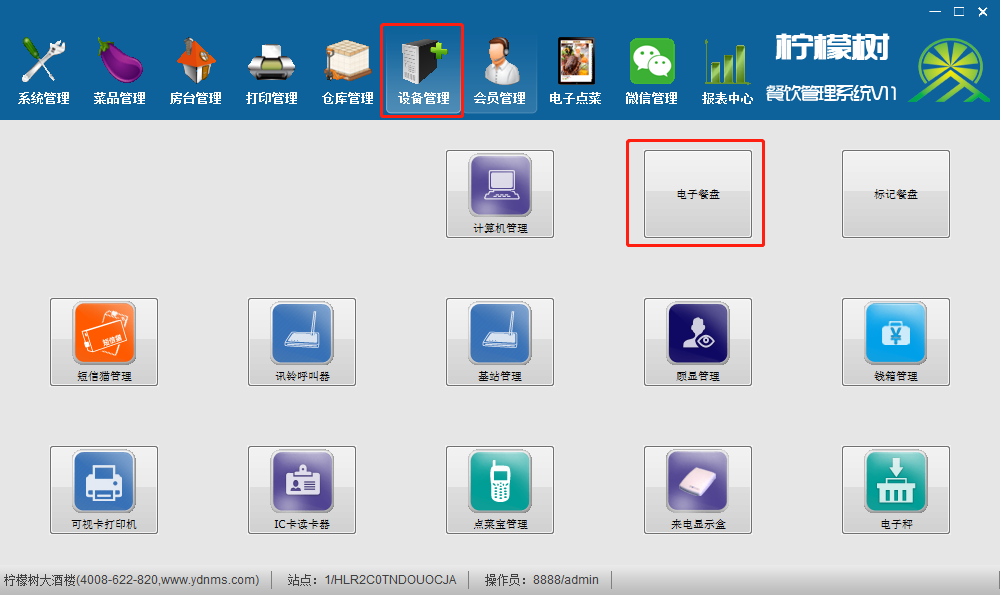
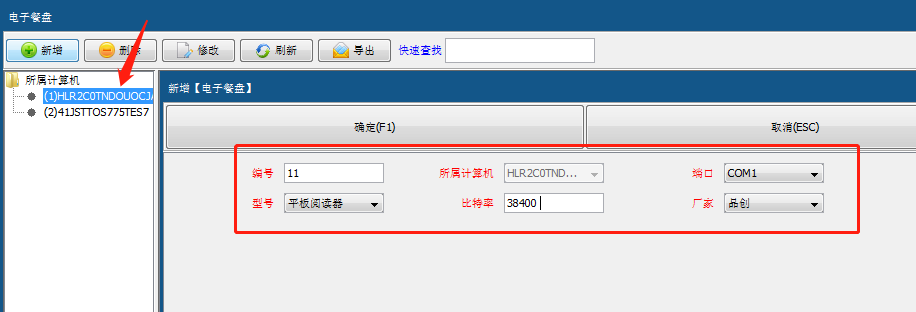
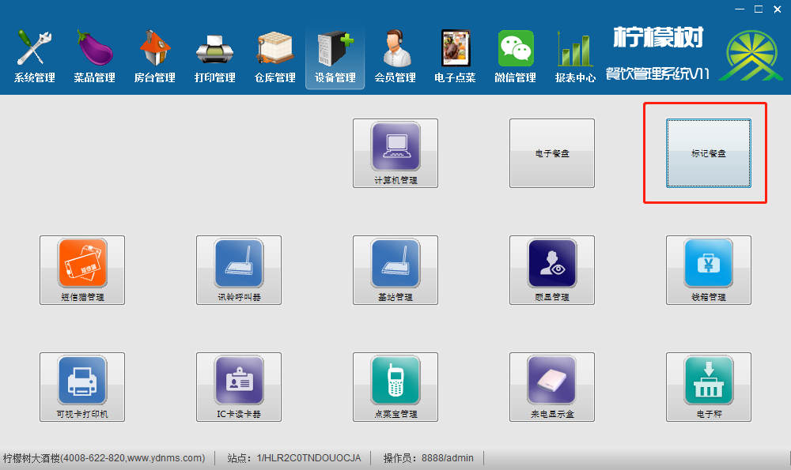

---
html:
  embed_local_images: true
  embed_svg: true
  offline: true

export_on_save:
  html: true
---

 # 品创电子餐盘设置
> - ### 后台>设备管理>电子餐盘>选中添加的计算机>添加>

> - ### 选择对应的COM口、型号：平板阅读器、比特率：38400、厂家：品创

# 标记餐盘

