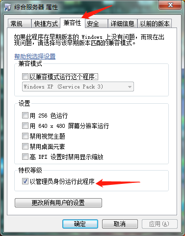
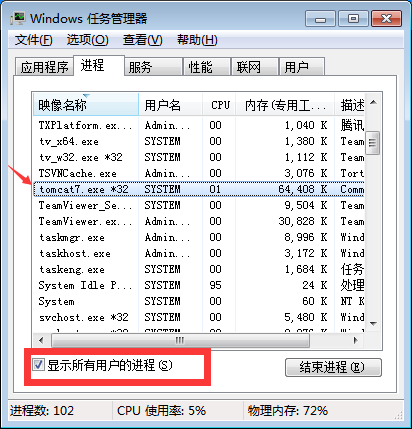

---
html:
  embed_local_images: true
  embed_svg: true
  offline: true

export_on_save:
  html: true
---

# 综合服务器提示 8888 端口被占用

## 问题现象

 > - ### 综合服务器提示 8888 端口被占用
 > - ### 楼面机显示软件未注册

## 问题原因

> - ### Windows10 对系统权限做了增强，一般软件不允许启动系统服务，而我们的注册服务器是作为系统服务运行的，如果没有管理权限的话，综合服务器就自动不了。

## 解决方法

> - ### 右键点击桌面上的综合服务器图标>选择属性>选择兼容性>特权等级>”以管理员身份运行“打勾>确定

> - ### 重新打开综合服务即可，如果不行退出综合服务器查看事务管理器查看Tomcat7是否运行，如有强制结束。

